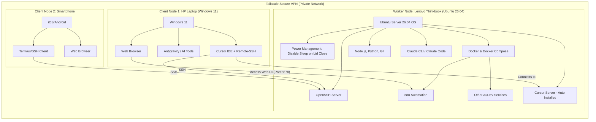

# Setup Remote AI Worker Environment

## Overview

This document will guide the installation and configuration of applications on an Ubuntu Server 26.04 (Worker Node) and client machines (Windows PC and smartphone).

Hệ thống này được thiết kế theo mô hình **"Thin Client - Fat Server"**, trong đó Ubuntu Server đóng vai trò là một *Remote AI Worker* (máy trạm xử lý trung tâm, phát triển hệ thống, tự động hóa AI, hoạt động 24/7). Người dùng sẽ điều khiển từ xa thông qua laptop Windows 11 hoặc smartphone. 

**Lợi ích của kiến trúc này:**
1. **Tiết kiệm chi phí phần cứng:** Không cần đầu tư laptop hay máy trạm cá nhân quá đắt tiền. Máy chủ xử lý trung tâm (Server) thường cho hiệu năng trên giá thành tốt hơn.
2. **Sự liền mạch tuyệt đối:** Có thể ngắt kết nối (gập laptop client) bất kỳ lúc nào, các tiến trình (build hệ thống, train model, chạy các AI agent) vẫn tiếp tục hoạt động ngầm trên Server. Khi mở máy lại, mọi thứ vẫn giữ nguyên trạng thái.
3. **Môi trường độc lập & Sạch sẽ:** Client không cần cài cắm nhiều môi trường phức tạp. Mọi rủi ro về hệ điều hành hay tràn bộ nhớ chỉ xảy ra trên Server, có thể dễ dàng reboot mà không ảnh hưởng đến thiết bị cá nhân.
4. **Tự động hóa 24/7:** Các AI Agent (ví dụ n8n workflow) có thể hoạt động liên tục ngay cả khi bạn đang ngủ.
5. **Bước đệm hoàn hảo:** Việc triển khai trên laptop Lenovo cũ là bài thực hành tuyệt vời để làm quen với mô hình phát triển phân tán (distributed development) trước khi triển khai hệ thống Server AI chuyên dụng cho công ty.

## System Architecture

## Khái niệm & Phân chia vai trò

* **Worker Node (Lenovo Thinkbook 14 G2):** Đóng vai trò là một máy tính chính xử lý các tác vụ nặng (development, build web system, run AI models local, chạy background jobs qua n8n). Nó hoạt động 24/7. Vì là laptop, cần cấu hình OS (systemd-logind) để máy không Sleep/Suspend khi gập màn hình (Lid close). 
* **Client Node 1 (HP Windows 11):** Đóng vai trò là Terminal/Thin-Client. IDE (Cursor) được chạy tại đây, nhưng memory/CPU tiêu thụ thực tế nằm hoàn toàn trên Worker Node. Nhờ Remote-SSH, thao tác dev vẫn mượt mà dù máy client bị giới hạn phần cứng (16GB RAM, không thể nâng cấp).
* **Client Node 2 (Smartphone):** Dùng để truy cập SSH khẩn cấp (Termius) hoặc theo dõi, phê duyệt (approve) các workflow tự động qua Web UI của n8n khi đang đi ngoài đường.

## Thành phần Phần mềm (Software Components)

Dưới đây là danh sách các phần mềm và công cụ cốt lõi được triển khai trên từng thiết bị để kiến tạo nên hệ thống này:

### 1. Trên Worker Node (Ubuntu Server 26.04)
* **OpenSSH Server:** Cho phép máy Client kết nối điều khiển từ xa an toàn.
* **Tailscale:** Mạng VPN riêng tư, giúp kết nối các thiết bị mọi lúc mọi nơi mà không cần mở port Router.
* **Docker & Docker Compose:** Nền tảng chạy container, giúp quản lý n8n và các services khác một cách cô lập, sạch sẽ.
* **Môi trường Dev (Git, Node.js, Python):** Cung cấp runtime tiêu chuẩn cho việc lập trình hệ thống.
* **Claude CLI / Claude Code:** Công cụ thao tác với AI trực tiếp từ terminal.
* **n8n:** Nền tảng tự động hóa (automation) chạy 24/7.
* **Cursor Server:** Xử lý toàn bộ logic tính toán, index file (tự động cài khi kết nối Remote-SSH).

### 2. Trên Client Node 1 (Windows PC - HP)
* **Tailscale:** Tham gia vào mạng VPN cùng với Worker Node.
* **Cursor IDE (kèm Remote-SSH):** Đóng vai trò làm giao diện hiển thị (thin client).
* **Antigravity / Claude Code:** Điều khiển và chạy agent trên môi trường Windows.
* **Trình duyệt web:** Truy cập vào giao diện web của n8n qua địa chỉ IP Tailscale.

### 3. Trên Client Node 2 (Smartphone)
* **Tailscale:** App VPN trên thiết bị di động.
* **Termius (hoặc App SSH):** Kết nối khẩn cấp vào Server để gõ lệnh khi không mang laptop.
* **Trình duyệt web:** Theo dõi trạng thái và điều khiển n8n.

## Installation & Configuration Guide

Để xem các dòng lệnh cài đặt và cấu hình chi tiết (step-by-step) cho cả 3 thiết bị trên, vui lòng tham khảo sổ tay vận hành cài đặt.

👉 Xem tại file: [SetupRemoteAIWorkerInstallApps.md](SetupRemoteAIWorkerInstallApps.md)