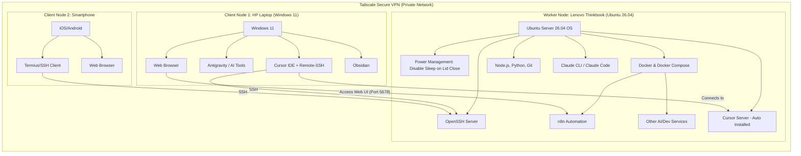

# Setup Remote AI Worker Environment

## Overview

This document will guide the installation and configuration of applications on an Ubuntu Server 26.04 (Worker Node) and client machines (Windows PC and smartphone).

Hệ thống này được thiết kế theo mô hình **"Thin Client - Fat Server"**, trong đó Ubuntu Server đóng vai trò là một *Remote AI Worker* (máy trạm xử lý trung tâm, phát triển hệ thống, tự động hóa AI, hoạt động 24/7). Người dùng sẽ điều khiển từ xa thông qua laptop Windows 11 hoặc smartphone. 

**Lợi ích của kiến trúc này:**
1. **Tiết kiệm chi phí phần cứng:** Không cần đầu tư laptop hay máy trạm cá nhân quá đắt tiền. Máy chủ xử lý trung tâm (Server) thường cho hiệu năng trên giá thành tốt hơn.
2. **Sự liền mạch tuyệt đối:** Có thể ngắt kết nối (gập laptop client) bất kỳ lúc nào, các tiến trình (build hệ thống, train model, chạy các AI agent) vẫn tiếp tục hoạt động ngầm trên Server. Khi mở máy lại, mọi thứ vẫn giữ nguyên trạng thái.
3. **Môi trường độc lập & Sạch sẽ:** Client không cần cài cắm nhiều môi trường phức tạp. Mọi rủi ro về hệ điều hành hay tràn bộ nhớ chỉ xảy ra trên Server, có thể dễ dàng reboot mà không ảnh hưởng đến thiết bị cá nhân.
4. **Tự động hóa 24/7:** Các AI Agent (ví dụ n8n workflow) có thể hoạt động liên tục ngay cả khi bạn đang ngủ.
5. **Bước đệm hoàn hảo:** Việc triển khai trên laptop Lenovo cũ là bài thực hành tuyệt vời để làm quen với mô hình phát triển phân tán (distributed development) trước khi triển khai hệ thống Server AI chuyên dụng cho công ty.

## System Architecture



## Khái niệm & Phân chia vai trò

* **Worker Node (Lenovo Thinkbook 14 G2):** Đóng vai trò là một máy tính chính xử lý các tác vụ nặng (development, build web system, run AI models local, chạy background jobs qua n8n). Nó hoạt động 24/7. Vì là laptop, cần cấu hình OS (systemd-logind) để máy không Sleep/Suspend khi gập màn hình (Lid close). 
* **Client Node 1 (HP Windows 11):** Đóng vai trò là Terminal/Thin-Client. IDE (Cursor) được chạy tại đây, nhưng memory/CPU tiêu thụ thực tế nằm hoàn toàn trên Worker Node. Nhờ Remote-SSH, thao tác dev vẫn mượt mà dù máy client bị giới hạn phần cứng (16GB RAM, không thể nâng cấp).
* **Client Node 2 (Smartphone):** Dùng để truy cập SSH khẩn cấp (Termius) hoặc theo dõi, phê duyệt (approve) các workflow tự động qua Web UI của n8n khi đang đi ngoài đường.

## Installation & Configuration Guide

### 1. Trên Worker Node (Ubuntu Server 26.04)

**1.1. Cấu hình chống ngủ đông (Prevent Sleep on Lid Close)**
Mặc định khi gập màn hình, laptop có thể bị sleep bởi systemd. Cần cấu hình `systemd-logind`:
```bash
sudo nano /etc/systemd/logind.conf
# Tìm và cấu hình các giá trị sau thành ignore:
# HandleLidSwitch=ignore
# HandleLidSwitchExternalPower=ignore
# HandleLidSwitchDocked=ignore

# Sau đó khởi động lại service
sudo systemctl restart systemd-logind.service
```
*(Lưu ý: Nếu sau khi cấu hình máy vẫn sleep, cần truy cập BIOS Lenovo để vô hiệu hóa tính năng tương tự).*

**1.2. Cài đặt các công cụ nền tảng**
* **OpenSSH Server:** Cần thiết để Client SSH vào.
* **Tailscale:** Mạng VPN riêng tư kết nối các thiết bị an toàn mà không cần mở port ra ngoài Internet.
* **Docker & Docker Compose:** Nền tảng chạy container cho n8n và các services khác, giúp quản lý gọn gàng.
* **Môi trường Dev:** Git, Node.js, Python.

**1.3. Cài đặt AI & Automation**
* **Claude CLI / Claude Code:** Cài đặt thông qua npm để thao tác với AI trên terminal.
* **n8n:** Triển khai bằng Docker Compose (publish port 5678).

*(Lưu ý: Cursor Server không cần cài thủ công. Khi Client dùng Cursor kết nối SSH vào, IDE sẽ tự động cài đặt Cursor Server trên Lenovo).*

### 2. Trên Client Node 1 (Windows PC - HP)

* **Tailscale:** Tham gia vào mạng VPN cùng Worker Node.
* **Cursor IDE:** Cài Extension `Remote - SSH`. Kết nối SSH tới IP Tailscale của Worker Node. Toàn bộ trải nghiệm code diễn ra tại đây.
* **Antigravity / Claude Code:** Cài trên Windows để điều khiển Worker Node.
* **Trình duyệt web:** Truy cập `http://<Tailscale_IP_Lenovo>:5678` để quản lý giao diện n8n.
* **Obsidian:** Chạy local trên Windows để làm Knowledge Base cho dự án One-Person Company (có thể tích hợp Claude sau).

### 3. Trên Client Node 2 (Smartphone)

* **Tailscale:** Ứng dụng Tailscale trên điện thoại.
* **Termius (hoặc App SSH bất kỳ):** Để SSH vào Lenovo khi đi ra ngoài cần chạy lệnh nhanh.
* **Trình duyệt web:** Truy cập Web UI n8n để xem trạng thái hoạt động của các agents.